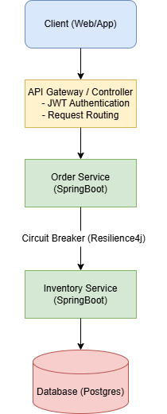

# Order Management System

A Spring Boot microservice-based backend system that demonstrates
service communication, JWT authentication, and fault tolerance.

---

## 🏗 System Architecture

Client → API Gateway → Order Service → Inventory Service → Database

---

## ⚙ Tech Stack

- Java
- Spring Boot
- Spring Security (JWT)
- Resilience4j
- Postgres

---

## 📂 Project Structure

order-management-system
├── api-gateway
├── order-service
├── inventory-service
└── docs
